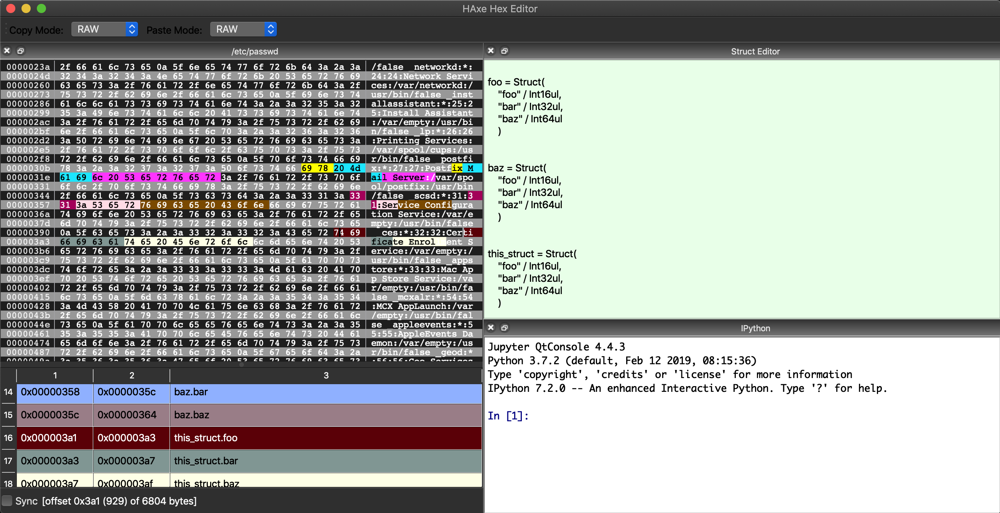

# HAXE - a pyqt based hex editor

python hex editor forked fromfrom csarn as qthexedit.

<pre>

currently supporting such wild features as:
	pure python3/pyqt5 (works on my mac!)
	copy!
	paste!
	cut!
	insert!
	delete!
	largefile support(a compromis that removes the above features.. labeled as a feature!)	
	the above features from ascii or binary sides depending on where you placed the cursur!
	copy paste binary data even though clipboard only likes strings!
	active/passive cursor so you can tell where you are!
	arrow key based cursor movement and selection using shift!
	undo stack!
	almost has a dynamic plugin architecture!
	almost has functional structure support!
	interactive python with a straightforward-ish Help() command and API
	bugs i havnt found in my obsessive feature adding!
	dynamic high contrast highlighting scheme 
	struct support using construct!
	savable bookmarks!
	
	
still to come:
	syncronizing documents 
	different then ascii encodings
	graphical view (bytes mapped to colors)
	loadable bookmarks
</pre>

<pre>
$ pythonw haxe.py  -f example/testfile
</pre>
